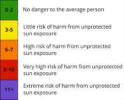

# Homework_6-Tanner
#### Synopsis: We were the create browser application that allowed a user to view the weather conditions in different cities implemented with the use of a weather API.
## Implementation Step
### Implement HTML and CSS according to the mockup.
### Implement Javascript
#### Onload
##### 1. Initialize look an feel to initial state.
##### 2. Load searches from previous session from brower storage into previous session buttons.
##### 3. Implement input fields and event listeners:
###### - City name text input field
###### - Submit city name text input field button
###### - City name input field event listener
###### - City name input field submit button event listener
#### On 'Enter' keyed on city text input field or submit button clicked:
##### 1. Construct URL from user input.
##### 2. Call URL
##### 3. Test response validity. In invalid, bail.
##### 4. Parse response JSON.
##### 5. Fill appropiate feilds with data elements. 
###### - URL 1, Single Day Forecast
###### - cityName, validated
###### - temp
###### - wind
###### - humidity
###### - uv index (background color coded according to NWS standard.)

###### - URL 2, Extended Forecast
###### - temp
###### - wind
###### - humidity
###### - weather code (for weather icon.)
## Acceptance Criteria
##### GIVEN a weather dashboard with form inputs
##### WHEN I search for a city
##### THEN I am presented with current and future conditions for that city and that city is added to the search history
##### WHEN I view current weather conditions for that city
##### THEN I am presented with the city name, the date, an icon representation of weather conditions, the temperature, the humidity, the wind speed, and the UV index
##### WHEN I view the UV index
##### THEN I am presented with a color that indicates whether the conditions are favorable, moderate, or severe
##### WHEN I view future weather conditions for that city
##### THEN I am presented with a 5-day forecast that displays the date, an icon representation of weather conditions, the temperature, the wind speed, and the humidity
##### WHEN I click on a city in the search history
##### THEN I am again presented with current and future conditions for that city
